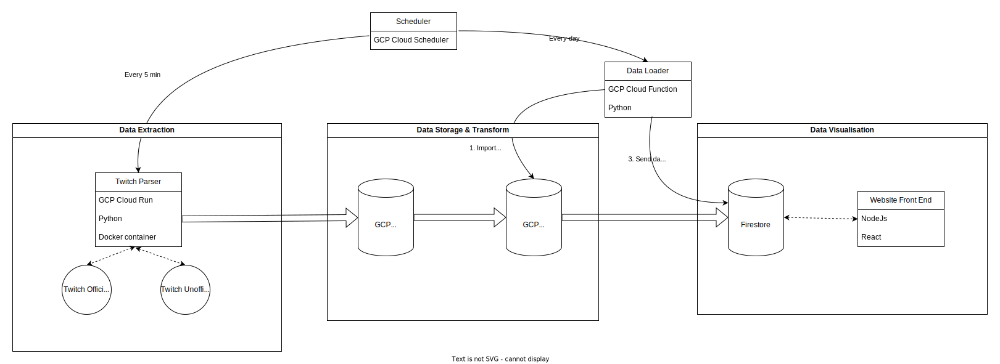
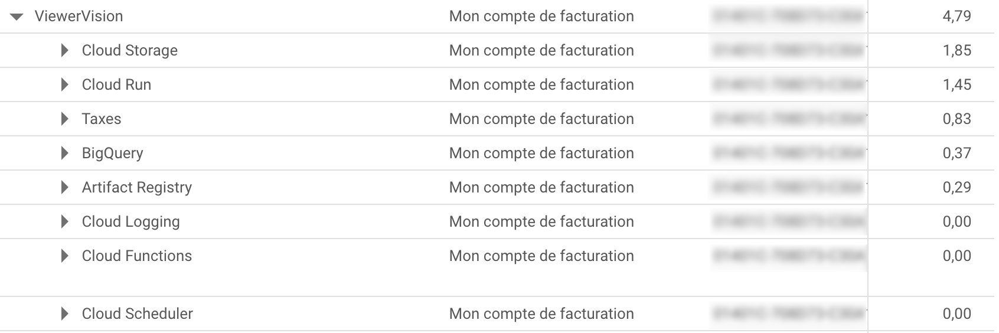

# 10M Twitch user tracking architecture - Thomas Bolteau - 2023

-   [Introduction and motivation](#introduction-and-motivation)
-   [Technologies used](#technologies-used)
-   [Architecture](#architecture)
    -   [Data extraction](#data-extraction)
    -   [Data storage & transformation](#data-storage-&-transformation)
    -   [Data processing](#data-processing)
    -   [Data visualization](#data-visualization)
-   [Cost Optimization](#cost-optimization)
-   [Legal issues](#legal-issues)

-   [Conclusion](#conclusion)

---

## Introduction and motivation

This project repose on the existance of an unoficial twitch api endpoint `http://tmi.twitch.tv/group/user/<channel_name>/chatters`. This enpoint return for a specific channel_name the username of people connected to the chat of the channel. As this is a unoficial api endpoint, there is no key required to use it and it is not rate limited. This allow to collect a lot of data about the people connected to the chat of a channel without their consent. If every channel on twitch is regularly queried, it is then possible to create a schedule for each twitch user, then to deduce their center of interest, life style, etc.

This project is has been made to sensibilize people about the possibilities of personnal data collection on the internet and the importance of having multiple digital identities.

Another purpose of this project was to practice the creation of a real, industry grade data pipeline architecture from what I learned during my studies, GCP Professional Data Engineer certification and hobby projects.

---

## Technologies used

This project is the combination of multiple technologies and services:

-   Language:
    -   Python (Data collection)
    -   SQL (Data processing and analysis)
    -   Javascript (Data visualization)
-   Services:
    -   Google Cloud Platform (Data storage, processing and visualization)
        -   Cloud Run (Data collection)
        -   Cloud Scheduler (Data collection)
        -   Cloud Function (Data processing)
        -   BigQuery (Data storage and processing)
        -   Cloud Storage (Data storage)
    -   Twitch API (Data collection)
    -   Firebase (Backend as a service for Data visualization)

---

## Architecture

Here is the representation of the architecture of the project:

### Data extraction

The data extraction is done by a `Cloud Run` instance that is triggered by a `Cloud Scheduler` every `5 minutes`. The Cloud Run instance is a `Python script` that uses the `Twitch API` to get the list of the 2000 most popular french streamers on Twitch.

> The list of streamers is then associated with a list of manually tracked streamer. This list of streamer is used to track the evolution of the popularity of the streamers over time even if they are not in the top 2000 most popular streamers.

During peak hours, less popular tracked streamer usually have `less than 10 simultaneous viewer`. Tracking more than 2000 streamer would allow to track the entire French Twitch community at any time but would also may not be very relevant as lot of small streamer usually have more bot in their chat than real viewer. For cost efficiency, the number of tracked streamer has been limited to 2000. Outside of peak hours, the number of viewer of the streamer in the top 2000 is usually more than the total number of french streamer so `the entire french Twitch community can be tracked`.

This list of streamer is than used to query the official twitch api to get information on their stream such as the `number of viewer`, `the stream name`, `the game they are playing`, etc. This information is supplemented by the unoficial twitch endpoint used to get the `username of the viewers`.

### Data storage & transformation

The raw data is then stored on Google Cloud Storage in a `csv` format. A particular attention has been given to the compression of the data. The data is stored in a `gzip` compressed format to reduce the storage cost.

A whole study has been made between `gzip`, `bzip2` and `lzma` compression algorithms. The `gzip` algorithm was chosen as the data was easily compressible. Using a more sophisticated algorithm would have not reduced the storage cost much more but would have increased the processing cost a lot.

The data is then imported to the BigQuery database by a `Cloud Function` that is triggered by a `Cloud Scheduler` job every day at 2 AM. The data is imported in a `raw` table. From these table (one for the viewer data and another for the streamer) multiple SQL queries are made to transform the data into a more usable format. Some data are extracted such as the user schedule, streamer schedule, etc.
Then views are created to reduce the cost.

Finaly the cloud function fetch the processed data and send it to the firebase database to be displayed on the website.

### Data visualisation

The website is composed of a frontend in `Javascript` and a backend using the `Firebase` backend as a service. This choice has been made to reduce the developpement time, as I am not expecting a lot of traffic on the website. The website is hosted on `Firebase Hosting`. All of this allow me to have a fully functional website in less than 2 days without having to manage any server as the main purpose of this project is the data pipeline.

From the [website](https://hexadecilab.com), it is possible to see the schedule of the streamer and the viewer for a specific day. It is also possible to see soem intresting ratio such as the number of viewer per streamer, the number of viewer over the day, etc.

---

## Cost Optimization

Multiple cost optimization have been made to reduce the cost of the project. The most important one is the use of the `gzip` compression algorithm. The data is easily compressible and the `gzip` for this kind of data. This is because of the possibility of BigQuery to load compressed csv in gzip format. This allow to reduce the storage cost by a factor of 10.

Another important cost optimization is the use of cloud run. The cloud run instance is a serverless instance that is only running when it is needed. The cloud instance is running approximately 30 seconds every 5 minutes. As the cost is proportional to the time the instance is running, optimising the time the instance is running is very important. The cloud run instance is also using the `europe-west1` region which is the cheapest region in Europe. Using asynchronous processing was necessary to reduce the cost of waiting for api response and so the cost of the cloud run instance. The main cost come from the internet egress (api call) but sadly there is no way to reduce this cost (100Go/month).

The utilisation of views in BigQuery is also very important to reduce the cost of the project. Using daily partitionning, clustering and nested fields allow to lower the cost and to scale up to the entire French Twitch community as an individual for approximately $5/month.

---

## Legal issues

For obvious GDPR reasons, the data collected by this project cannot be used for any commercial purpose. The data collected by this project is only used for educational purpose and to sensibilize people about the possibilities of personnal data collection on the internet and the importance of having multiple digital identities.

The GDPR state Article 2.2.c that :
`This Regulation does not apply to the processing of personal data by a natural person in the course of a purely personal or household activity`

This mean that an individual like me can collect and process this data without the consent of the streamer or the viewer but cannot use this data for any commercial purpose.

---

## Conclusion

This project enlight the necessity to have multiple digital identity as the data collected by this project can be used to identify a person. I am for sure not the first one to do that and multiple people probably already have such a database and can use it to get personnal information about people. This would be concerning as these information car be used to do a lot of things such as stalking, political clustering, blackmailing, etc.

From a technical point of view this project taught me a lot about the creation of a real, industry grade data pipeline architecture. I also learned a lot about the GDPR and the personnal data processing.
